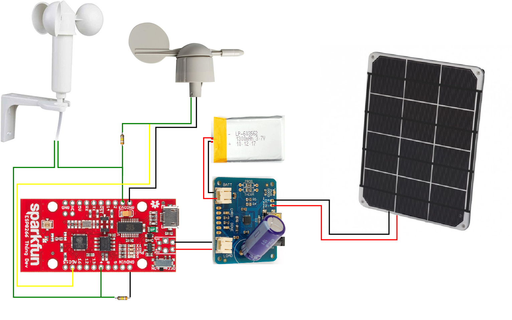

# WeatherPi Anemometer

## Wind Vane

| Direction (Degrees) | Dir. | Resistance (Ohms) | Voltage (V=3.3v, R=300k) |
| +++++++             | ++  | ++++++++          | +++++++++++++++++        |   
|0                    | N   | 33k               |     0.33v                |                   
|22.5                 | NNE | 6.57k             |     0.07v                |
|45                   | NE  | 8.2k              |     0.088v               |                  
|67.5                 | ENE | 891               |     0.01v                |
|90                   | E   | 1k                |     0.011v               |                  
|112.5                | ESE | 688               |     0.008v               |              
|135                  | SE  | 2.2k              |     0.024v               |  
|157.5                | SSE | 1.41k             |     0.015v               |              
|180                  | S   | 3.9k              |     0.042v               |  
|202.5                | SSW | 3.14k             |     0.034v               |
|247.5                | SW  | 14.12k            |     0.15v                |
|225                  | WSW | 16k               |     0.17v                |
|270                  | W   | 120k              |     0.94v                |
|292.5                | WNW | 42.12k            |     0.41v                |
|315                  | NW  | 64.9k             |     0.59v                |
|337.5                | NNW | 21.88k            |     0.223v               |              
